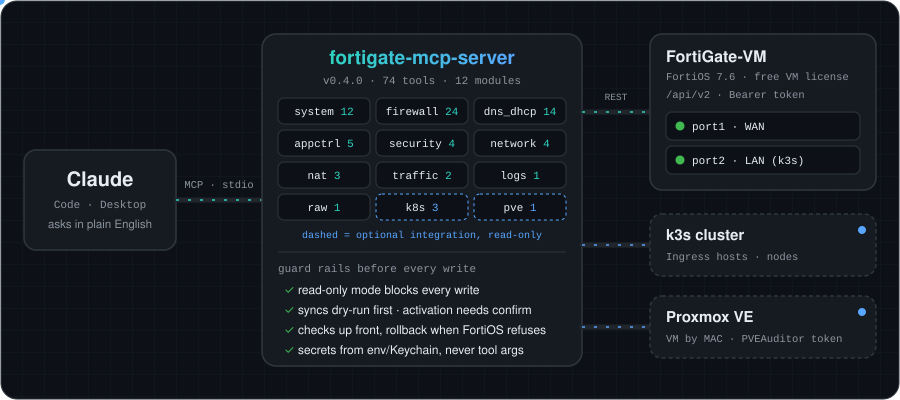
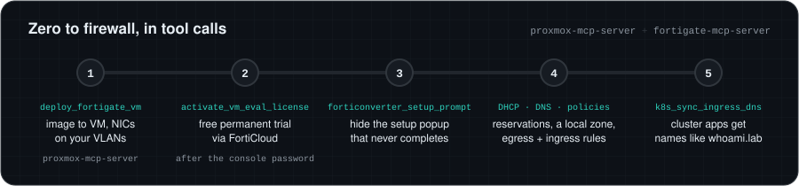
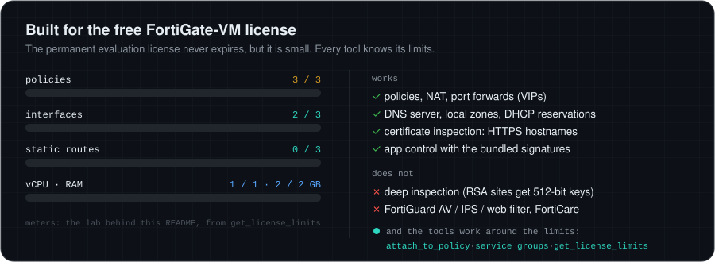

<p align="center"></p>

<p align="center">
  <a href="https://github.com/ry-ops/fortigate-mcp-server/releases"></a>
  <a href="https://github.com/ry-ops/fortigate-mcp-server/actions/workflows/ci.yml"></a>
  
  
  <a href="https://modelcontextprotocol.io"></a>
  <a href="LICENSE"></a>
</p>

**fortigate-mcp-server** lets Claude (or any [MCP](https://modelcontextprotocol.io) client) run a Fortinet FortiGate through the FortiOS REST API: firewall policies, NAT and port forwards, DNS and DHCP, application control, inspection, live traffic and logs. It was built and tested against a FortiGate-VM on the **free permanent evaluation license** fronting a k3s cluster on Proxmox, so it knows that license's limits and FortiOS 7.6's quirks, and it can connect the firewall to the cluster and to the hypervisor around it.

<p align="center"></p>

## What makes it different

- **Built for the free FortiGate-VM.** The permanent evaluation license allows 3 policies, 3 interfaces and 3 static routes, has no FortiGuard services and runs in low-encryption mode. `get_license_limits` shows what is used; port forwards attach to existing policies instead of needing new ones; service groups fold several ports into one policy; and this README says what does not work there (deep inspection) before you lose an afternoon to it.
- **It knows FortiOS 7.6's traps.** VIPs cannot share a policy with ordinary addresses, app-control profiles start with a catch-all pass rule, DHCP reservations need `action=reserved`, `vci-match` silently ignores normal clients, and local DNS zones cannot hold wildcards. The tools check for these up front and say so plainly. See [FortiOS 7.6 field notes](#fortios-76-field-notes).
- **It speaks your infrastructure.** Optional integrations read your k3s cluster (Ingress hostnames become FortiGate DNS records; node IPs keep the address objects your policies use in sync) and your Proxmox VE host (every IP and MAC in leases, sessions, FortiView and logs gets the name of the VM behind it).
- **Safe by default.** A read-only switch refuses every write before it leaves your machine; sync tools dry-run first; license activation needs `confirm=true`; a failed port forward rolls itself back; credentials come from the environment (or your keychain), never from tool arguments.
- **Errors that explain.** FortiOS hides the reason for a failure in the response body (`cli_error`). Every error message includes it, so "HTTP 500" becomes "Addresses/groups cannot be mixed with virtual IPs".
- **Tested against a real FortiGate.** Every tool was run against FortiOS 7.6.7 on a FortiGate-VM, on top of a unit-test suite that runs in CI on Python 3.10 to 3.13.

<p align="center"></p>

## Quick start

**You need** Python 3.10+ with [uv](https://docs.astral.sh/uv/), a FortiGate running FortiOS 7.6 (appliance or VM, licensed; see [zero to firewall](#zero-to-firewall) to deploy a free one), and a REST API token.

### 1. Create an API token on the FortiGate

In the GUI: **System > Administrators > Create New > REST API Admin**. Pick an administrator profile (`super_admin` to allow changes, or a read-only profile so FortiOS also refuses writes), set **Trusted Hosts** to the machine that runs this server, and save. The key is shown once.

Or on the CLI (FortiOS asks for your admin password before it creates an admin):

```text
config system api-user
    edit mcp-api
        set accprofile super_admin
        set vdom root
        config trusthost
            edit 1
                set ipv4-trusthost 192.168.1.50 255.255.255.255
            next
        end
    next
end
execute api-user generate-key mcp-api
```

### 2. Add it to Claude Code

```bash
claude mcp add fortigate --scope user \
  -e FORTIGATE_HOST=192.168.1.99 \
  -e FORTIGATE_API_TOKEN=your-token \
  -e FORTIGATE_READ_ONLY=true \
  -- uvx --from git+https://github.com/ry-ops/fortigate-mcp-server@v0.4.1 fortigate-mcp-server
```

On macOS you can keep the token in your Keychain instead of in Claude's config:

```bash
security add-generic-password -a mcp-api -s fortigate-api-token -w   # paste the token when asked

claude mcp add fortigate --scope user -e FORTIGATE_HOST=192.168.1.99 -e FORTIGATE_READ_ONLY=true -- \
  sh -c 'FORTIGATE_API_TOKEN="$(security find-generic-password -a mcp-api -s fortigate-api-token -w)" exec uvx --from git+https://github.com/ry-ops/fortigate-mcp-server@v0.4.1 fortigate-mcp-server'
```

<details><summary><b>Claude Desktop</b></summary>

```json
{
  "mcpServers": {
    "fortigate": {
      "command": "uvx",
      "args": ["--from", "git+https://github.com/ry-ops/fortigate-mcp-server@v0.4.1", "fortigate-mcp-server"],
      "env": {
        "FORTIGATE_HOST": "192.168.1.99",
        "FORTIGATE_API_TOKEN": "your-token",
        "FORTIGATE_READ_ONLY": "true"
      }
    }
  }
}
```
</details>

<details><summary><b>From a clone</b></summary>

```bash
git clone https://github.com/ry-ops/fortigate-mcp-server && cd fortigate-mcp-server
uv sync
cp .env.example .env   # fill in FORTIGATE_HOST and FORTIGATE_API_TOKEN
uv run fortigate-mcp-server
```
</details>

### 3. Ask

Start read-only and look around:

- *"What's the license status, and how many policies can I still add?"*
- *"Show the firewall policies and how often each one is hit."*
- *"Who is using the most bandwidth right now?"*
- *"Which HTTPS sites did 192.168.150.11 visit in the last few minutes?"*
- *"Back up the running config."* (allowed in read-only mode; it writes a local file)

When you want Claude to make changes, set `FORTIGATE_READ_ONLY=false`.

## Zero to firewall

<p align="center"></p>

With [proxmox-mcp-server](https://github.com/ry-ops/proxmox-mcp-server) (v2.3.0+) alongside, Claude can take an empty Proxmox host to a working firewall:

1. **Deploy.** Download Fortinet's FortiGate-VM KVM image (the `.qcow2` inside the `.zip` from the Fortinet support site) and serve it over HTTP. `deploy_fortigate_vm` (proxmox-mcp-server) imports it, creates the VM with port1 (WAN) and port2 (LAN) on the bridges and VLANs you choose, and returns each port's MAC.
2. **License.** On the VM console, log in as `admin` with an empty password and set a new one (12+ characters with upper, lower, number and symbol). port1 comes up as a DHCP client. An unlicensed VM refuses most API calls and its GUI goes blank after login, so run `activate_vm_eval_license` with session auth (`FORTIGATE_USERNAME`/`FORTIGATE_PASSWORD`) and your FortiCloud account in `FORTICLOUD_ACCOUNT`/`FORTICLOUD_PASSWORD`. The FortiGate reboots with the free permanent license. Then create the API token (step 1 of the quick start) and switch to it.
3. **Hide the setup popup.** The GUI's "FortiGate Setup" popup waits on a FortiConverter eligibility check that evaluation VMs never pass, so it comes back at every login. `forticonverter_setup_prompt` with `hide=true` turns it off.
4. **Build the lab network.** Give port2 an address, then `set_dns_server`, `create_dns_zone`, `update_dhcp_server` and `add_dhcp_reservation` for DNS and DHCP, and `create_firewall_policy` for egress and ingress.
5. **Name the apps.** `k8s_sync_ingress_dns` turns every Ingress hostname in your cluster into FortiGate DNS records.

## Built for the free license

<p align="center"></p>

The FortiGate-VM permanent evaluation license (FortiOS 7.2.1+) is free with a FortiCloud account and never expires. Its limits, and how this server deals with them:

| Limit | What the tools do |
|---|---|
| 3 firewall policies | `get_license_limits` counts them. `create_port_forward` attaches to an existing policy (`attach_to_policy`) and says so when no slot is free. Service groups let one policy cover several ports. |
| 3 interfaces, 3 static routes | Counted by `get_license_limits`. |
| 1 vCPU, 2 GB RAM | `deploy_fortigate_vm` (proxmox-mcp-server) defaults to exactly that and warns above it. |
| No FortiGuard services (AV, IPS, web filter) or FortiCare | App control works with the signatures bundled in FortiOS. Category blocking needs a subscription. |
| Low-encryption mode | **Certificate inspection works**: the app-ctrl log names every HTTPS site without decrypting anything. **Deep inspection does not**: the factory CA is 512-bit, and even with your own 2048-bit CA, sites with RSA keys are re-signed with 512-bit keys that curl, Go and containerd reject (container image pulls fail). `list_certificates` flags those weak keys. |

## Integrations

Both are optional. They switch on when their variables are set, and their tools only appear then.

**k3s / Kubernetes** (`K8S_KUBECONFIG`, optional `K8S_CONTEXT`). The cluster is only read; kubeconfigs with certificate, token or basic users work (not exec plugins).

- `k8s_cluster_overview`: nodes, LoadBalancer services (such as Traefik on k3s ServiceLB) and every Ingress or Traefik IngressRoute hostname.
- `k8s_sync_ingress_dns`: FortiOS local DNS zones cannot hold a wildcard like `*.lab`, so this creates one A record per ingress IP for each hostname inside the zone. Wildcard, apex and out-of-zone hosts are skipped and listed. `prune=true` removes stale records that point at ingress IPs.
- `k8s_sync_node_addresses`: keeps the address object your policies use (default `K3S-NODES`) matched to the node IPs: a range when they are contiguous, otherwise one /32 address per node in an address group.

Both sync tools return their plan with `dry_run=true` (the default) and change the FortiGate only with `dry_run=false`.

**Proxmox VE** (`PROXMOX_HOST`, `PROXMOX_USER`, `PROXMOX_TOKEN_NAME`, `PROXMOX_TOKEN_VALUE`; the same names as [proxmox-mcp-server](https://github.com/ry-ops/proxmox-mcp-server)). Only GET requests are made, so create the token with privilege separation and just the `PVEAuditor` role.

- `identify_clients`: every DHCP lease and ARP entry on the FortiGate, matched by MAC to the Proxmox VM or container behind it (VMID, name, node, bridge, VLAN tag).
- `resolve_vms=true` on `get_logs`, `list_sessions`, `get_top_traffic` and `list_dhcp_leases` adds labels such as `srcip_vm: "112 k3s-worker2 (qemu on pve01)"`.

## Tools

<!-- TOOLS:START -->

**74 tools** in 12 areas. Expand an area for one line per tool; your MCP client shows each tool's full description and input schema.

<details><summary><b>System, license and interfaces</b> · 12</summary>

| Tool | What it does |
|---|---|
| `get_system_status` | FortiGate model, serial, firmware version/build, hostname and uptime. |
| `get_license_status` | License and FortiGuard contract status. |
| `get_license_limits` | How much of the license's object limits is used. |
| `get_resource_usage` | Current CPU, memory, disk and session usage. |
| `list_interfaces` | List interface configuration (IP, mode, role, alias, allowaccess). |
| `get_interface` | Get one interface's full configuration. |
| `get_interface_status` | Live interface state: link, speed, IP and traffic counters. |
| `update_interface` | Update an interface. |
| `list_admin_sessions` | Administrators currently logged in (GUI, SSH, API) and where from. |
| `backup_config` | Back up the full running configuration (FortiOS CLI text) to a local file and return its path and size. |
| `forticonverter_setup_prompt` | Show or hide the 'Migrate Config with FortiConverter' step of the GUI's FortiGate Setup popup. |
| `activate_vm_eval_license` | Activate the free permanent evaluation license on an unlicensed FortiGate-VM by logging in to FortiCloud from the FortiGate (the same call the GUI makes). |

</details>

<details><summary><b>Firewall policies, addresses and services</b> · 24</summary>

| Tool | What it does |
|---|---|
| `list_firewall_policies` | List IPv4 firewall policies in evaluation order. |
| `get_firewall_policy` | Get one firewall policy. |
| `create_firewall_policy` | Create a firewall policy. |
| `update_firewall_policy` | Update a firewall policy. |
| `delete_firewall_policy` | Delete a firewall policy. |
| `move_firewall_policy` | Move a policy before or after another one (policies match top-down). |
| `get_policy_stats` | Hit counts, bytes, packets and last-used time per policy. |
| `list_sessions` | Current firewall sessions, optionally filtered. |
| `list_addresses` | List firewall address objects. |
| `get_address` | Get one firewall address object. |
| `create_address` | Create a firewall address: a subnet/host, an IP range, or an FQDN. |
| `update_address` | Update a firewall address object. |
| `delete_address` | Delete a firewall address (fails while a policy or group still uses it). |
| `list_address_groups` | List firewall address groups and their members. |
| `create_address_group` | Create an address group. |
| `update_address_group` | Update an address group. members replaces the whole member list. |
| `delete_address_group` | Delete an address group (fails while a policy still uses it). |
| `list_services` | List custom firewall services (port definitions). |
| `create_service` | Create a custom TCP/UDP service. |
| `list_service_groups` | List service groups and their members. |
| `create_service_group` | Create a service group, e.g. |
| `update_service_group` | Update a service group. members replaces the whole member list. |
| `delete_service_group` | Delete a service group (fails while a policy still uses it). |
| `delete_service` | Delete a custom service (fails while a policy still uses it). |

</details>

<details><summary><b>Port forwards (VIPs)</b> · 3</summary>

| Tool | What it does |
|---|---|
| `list_port_forwards` | List virtual IPs (port forwards / static NAT) and the policies that use each one. |
| `create_port_forward` | Create a port forward (VIP): traffic arriving on extintf at extip:extport goes to mappedip:mappedport. |
| `delete_port_forward` | Delete a VIP. |

</details>

<details><summary><b>Application control</b> · 5</summary>

| Tool | What it does |
|---|---|
| `search_applications` | Search application-control signatures by name (contains, case-insensitive) and/or category, e.g. query=YouTube or category=P2P. |
| `list_app_categories` | Application-control categories (id and name), e.g. |
| `list_app_control_profiles` | App-control profiles with their rules, showing application and category names instead of ids. |
| `add_app_control_rule` | Add a rule to an app-control profile matching applications and/or categories by name (or id). |
| `delete_app_control_rule` | Remove a rule from an app-control profile by its id (see list_app_control_profiles). |

</details>

<details><summary><b>Inspection profiles and certificates</b> · 4</summary>

| Tool | What it does |
|---|---|
| `list_ssl_ssh_profiles` | List SSL/SSH inspection profiles with the CA each one re-signs with. |
| `update_ssl_ssh_profile` | Update an SSL/SSH inspection profile, e.g. the CA used to re-sign certificates during deep inspection. |
| `list_certificates` | List local and CA certificates with key type and size, validity and usage flags. |
| `download_certificate` | Download a certificate's PEM (public part only), e.g. the deep-inspection CA Fortinet_CA_SSL so clients can be told to trust it. |

</details>

<details><summary><b>Live traffic</b> · 2</summary>

| Tool | What it does |
|---|---|
| `get_top_traffic` | Live FortiView summary of the sessions passing through right now, grouped by source, destination, application, country, interface, policy or protocol. |
| `get_arp_table` | IPv4 ARP table: which MAC answers for which IP on each interface. |

</details>

<details><summary><b>Logs</b> · 1</summary>

| Tool | What it does |
|---|---|
| `get_logs` | Read FortiGate logs, newest first. |

</details>

<details><summary><b>Routing</b> · 4</summary>

| Tool | What it does |
|---|---|
| `get_routing_table` | Active IPv4 routing table (connected, static, DHCP-learned and dynamic routes). |
| `list_static_routes` | List configured static routes. |
| `create_static_route` | Add a static route. |
| `delete_static_route` | Delete a static route by its sequence number (seq-num from list_static_routes). |

</details>

<details><summary><b>DNS and DHCP</b> · 14</summary>

| Tool | What it does |
|---|---|
| `get_dns_settings` | System DNS settings: upstream resolvers the FortiGate itself uses and forwards to. |
| `list_dns_servers` | Interfaces where the FortiGate answers DNS queries, and in which mode. |
| `set_dns_server` | Serve DNS on an interface. |
| `delete_dns_server` | Stop serving DNS on an interface. |
| `list_dns_zones` | List local DNS zones (dns-database) with their records. |
| `create_dns_zone` | Create a local DNS zone. view=shadow serves internal clients. |
| `delete_dns_zone` | Delete a local DNS zone and all its records. |
| `add_dns_record` | Add a record to a local DNS zone. |
| `delete_dns_record` | Delete a record from a local DNS zone by its id (see list_dns_zones). |
| `list_dhcp_servers` | List DHCP servers with their ranges, options and reservations. |
| `list_dhcp_leases` | Current DHCP leases handed out by the FortiGate. |
| `update_dhcp_server` | Update a DHCP server. |
| `add_dhcp_reservation` | Reserve an IP for a MAC address on a DHCP server (the IP may sit outside the pool). |
| `delete_dhcp_reservation` | Remove a DHCP reservation by its id (see list_dhcp_servers). |

</details>

<details><summary><b>Kubernetes (optional, `K8S_KUBECONFIG`)</b> · 3</summary>

| Tool | What it does |
|---|---|
| `k8s_cluster_overview` | Read the Kubernetes cluster from K8S_KUBECONFIG: nodes with IPs and readiness, LoadBalancer services with their IPs (e.g. |
| `k8s_sync_ingress_dns` | Create FortiGate DNS records for the cluster's Ingress hostnames that fall inside a local zone (e.g. whoami.lab in zone 'lab'), pointing at the IPs the ingress is served on. |
| `k8s_sync_node_addresses` | Keep a FortiGate address object in step with the cluster's node IPs so policies follow the cluster. |

</details>

<details><summary><b>Proxmox VE (optional, `PROXMOX_*`)</b> · 1</summary>

| Tool | What it does |
|---|---|
| `identify_clients` | Every client the FortiGate knows (DHCP leases and ARP entries) matched by MAC address to the Proxmox VM or container that owns it: VMID, name, node, status, bridge and VLAN tag. |

</details>

<details><summary><b>Raw API</b> · 1</summary>

| Tool | What it does |
|---|---|
| `fortigate_api` | Call any FortiOS REST endpoint directly. path must start with /api/v2/ (cmdb/... for configuration, monitor/... for live state). |

</details>

<!-- TOOLS:END -->

Tools take friendly arguments and build the FortiOS body for you: CIDR (`10.0.0.0/24`) instead of `ip mask`, plain lists (`["port1"]`) instead of `[{"name": "port1"}]`, and booleans instead of `enable`/`disable`. Create and update tools also accept `extra`, merged into the request body as-is, for attributes a tool does not model. Anything without a dedicated tool is reachable through `fortigate_api`.

## Safety model

| Guard | What it does |
|---|---|
| `FORTIGATE_READ_ONLY=true` | The client refuses every POST, PUT and DELETE before it reaches the FortiGate. The only exception is `backup_config`, whose POST only reads. Pair it with a read-only admin profile so FortiOS enforces the same thing. |
| Dry runs | `k8s_sync_ingress_dns` and `k8s_sync_node_addresses` show their plan unless `dry_run=false`. |
| Confirmation | `activate_vm_eval_license` reboots the FortiGate, so it requires `confirm=true`, and does nothing on a licensed VM. |
| Checks before writes | `create_port_forward` checks the target policy's interface and destinations before creating the VIP; wildcard DNS records and edits to read-only built-in profiles are refused up front. |
| Rollback | A VIP that its policy refuses is deleted again, so nothing is left half-done. |
| Secrets | API tokens and the FortiCloud login come from environment variables (or a keychain, see the quick start), never from tool arguments, so they do not end up in chat transcripts. |

## FortiOS 7.6 field notes

Things this server handles because they bit us on a real FortiGate-VM:

- **7.6 dropped `/logincheck`.** Session login is a JSON `POST /api/v2/authentication`, and the CSRF cookie is named `ccsrf_token_<port>_<hash>`. The client does both and logs in again once if the session times out.
- **VIPs cannot share a policy's destinations with ordinary addresses** ("Addresses/groups cannot be mixed with virtual IPs").
- **App-control profiles start with a catch-all pass rule**, so rules appended after it never match. New rules go to the top.
- **DHCP reservations need `action=reserved`.** With the default `assign` the `ip` field does not exist.
- **New DHCP servers can default to `vci-match`** for FortiSwitch/FortiExtender vendor classes, which silently ignores ordinary clients. `update_dhcp_server` takes `vci_match=false`.
- **Local DNS zones cannot hold `*` records.** `add_dns_record` refuses them; `k8s_sync_ingress_dns` writes one record per name instead.
- **An SSL inspection profile does nothing on its own in flow mode.** Traffic is only inspected once a security profile (e.g. application control `default`) is attached; policy tools warn when that is missing.
- **Endpoints moved in 7.6.** FortiView is `monitor/fortiview/realtime-statistics` (the old `statistics` is gone), sessions are `monitor/firewall/sessions`, and config backups are a POST.
- **The setup popup on evaluation VMs** never completes its FortiConverter step. The undocumented `POST /api/v2/monitor/forticonverter/show-in-startup/set` with `{"hide": true}` hides it (`forticonverter_setup_prompt`).
- **Unlicensed VMs** answer most calls with 401, and the GUI goes blank after login, so activate the license through the API (`activate_vm_eval_license`).

## Configuration

| Variable | Default | |
|---|---|---|
| `FORTIGATE_HOST` | (required) | Hostname or IP |
| `FORTIGATE_PORT` | `443` | HTTPS admin port |
| `FORTIGATE_API_TOKEN` | | REST API admin token (recommended) |
| `FORTIGATE_USERNAME` / `FORTIGATE_PASSWORD` | | Session login, used when no token is set (needed on an unlicensed VM) |
| `FORTIGATE_VDOM` | `root` | VDOM for every call (tools also take `vdom`) |
| `FORTIGATE_VERIFY_SSL` | `false` | Verify the TLS certificate |
| `FORTIGATE_READ_ONLY` | `false` | Refuse every POST/PUT/DELETE before it reaches the FortiGate |
| `FORTIGATE_TIMEOUT` | `30` | Request timeout in seconds |
| `K8S_KUBECONFIG` / `K8S_CONTEXT` | | Enables the Kubernetes tools |
| `PROXMOX_HOST`, `PROXMOX_USER`, `PROXMOX_TOKEN_NAME`, `PROXMOX_TOKEN_VALUE`, `PROXMOX_PORT`, `PROXMOX_VERIFY_SSL` | | Enables the Proxmox tools |
| `FORTICLOUD_ACCOUNT` / `FORTICLOUD_PASSWORD` | | Only for `activate_vm_eval_license` (main FortiCloud account, 2FA off) |

Variables can also go in a `.env` file next to the server; see [`.env.example`](.env.example).

## Compatibility

| | Tested | Expected to work |
|---|---|---|
| FortiOS | 7.6.7 (build 3704), FortiGate-VM on KVM/Proxmox, permanent evaluation license | Other 7.6 builds and licensed FortiGate-VMs or appliances. 7.4 and older have not been tested; a few endpoints differ (see the field notes). |
| Python | 3.10, 3.11, 3.12, 3.13 (CI) | |
| MCP clients | Claude Code | Claude Desktop and other stdio MCP clients |
| Integrations | k3s v1.36 with Traefik; Proxmox VE 9.2 | Other Kubernetes distributions (standard Ingress); Proxmox VE 8.x |

## Releases and versioning

Versions follow [Semantic Versioning](https://semver.org). Every release is tagged and listed on the [releases page](https://github.com/ry-ops/fortigate-mcp-server/releases), and [CHANGELOG.md](CHANGELOG.md) records what changed. Pin a release with `git+https://github.com/ry-ops/fortigate-mcp-server@v0.4.1`; drop the `@v…` to track `main`. The version is in `pyproject.toml` and `fortigate_mcp.__version__`.

## Development

```bash
uv sync
uv run pytest
uv run ruff check .
python3 scripts/gen_tool_catalog.py        # refresh the tool catalog above
python3 scripts/build_demo_svg.py          # rebuild docs/demo.svg
```

CI runs ruff, the tests on Python 3.10 to 3.13, and a check that the tool catalog matches the code. Each tool module (`fortigate_mcp/tools/*.py`) has a `TOOLS` list and a `handle()` function; `server.py` registers them, and the Kubernetes and Proxmox modules only when configured.

## Related

- [proxmox-mcp-server](https://github.com/ry-ops/proxmox-mcp-server): the Proxmox VE API as MCP tools, including `deploy_fortigate_vm`.

## Disclaimer

This is an independent project, not affiliated with or endorsed by Fortinet. Fortinet, FortiGate, FortiOS, FortiGuard, FortiCare and FortiCloud are trademarks of Fortinet, Inc.

## License

[MIT](LICENSE)

<!-- org-footer -->
---

<p align="center"><sub>Part of <a href="https://github.com/ry-ops">ry-ops</a> · building the pipes between infrastructure, automation, and observability · built by <a href="https://github.com/ry-ops">ry-ops</a></sub></p>
